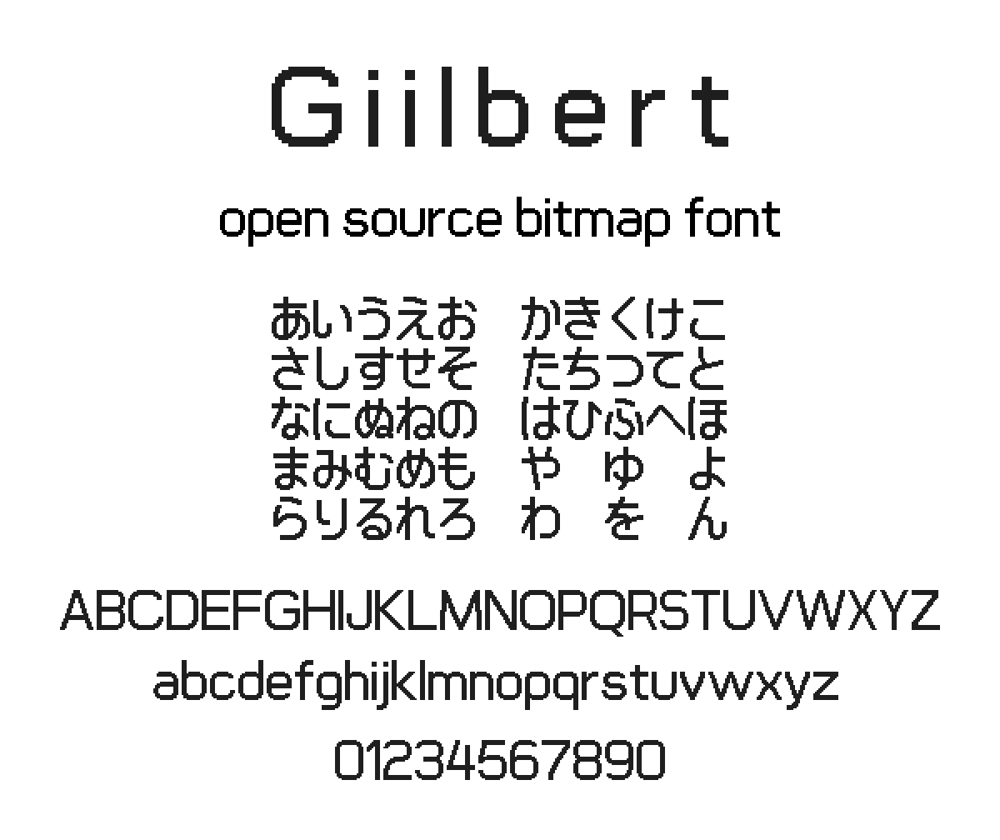
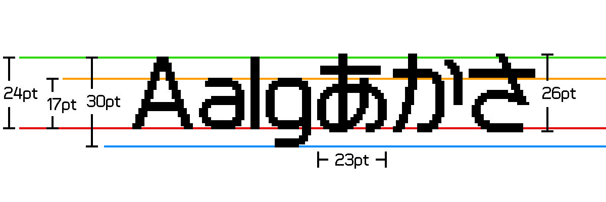

# Giilbert - bitmap font

# デザイン

Squircle をベースにした、直線的でありながら丸っこい要素も含んだデザインのビットマップフォントです。  
線の太さは 3 ピクセルと太く明快です。

**※足りないグリフが多いので実使用には耐えないと思います。**

# 仕様

- 推奨フォントサイズ（px）：30 の倍数
- 収録文字：半角英数字・記号（一部未作成）、ひらがな（一部未作成）  
  カタカナも作成予定ですが、よっぽどの事情がない限り漢字は作る気は無いです。
- 形式：.ttf, .bdf

# ダウンロード

[こちら](https://github.com/yuyasvx/giilbert/releases)からどうぞ。

# Contribution

申し訳ないですが、あまり時間が取れない気がするので受け付けていません。。
